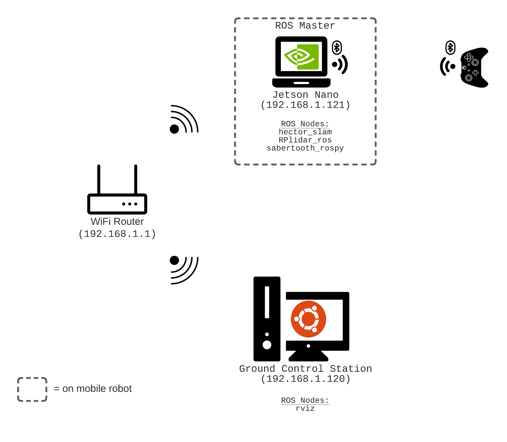
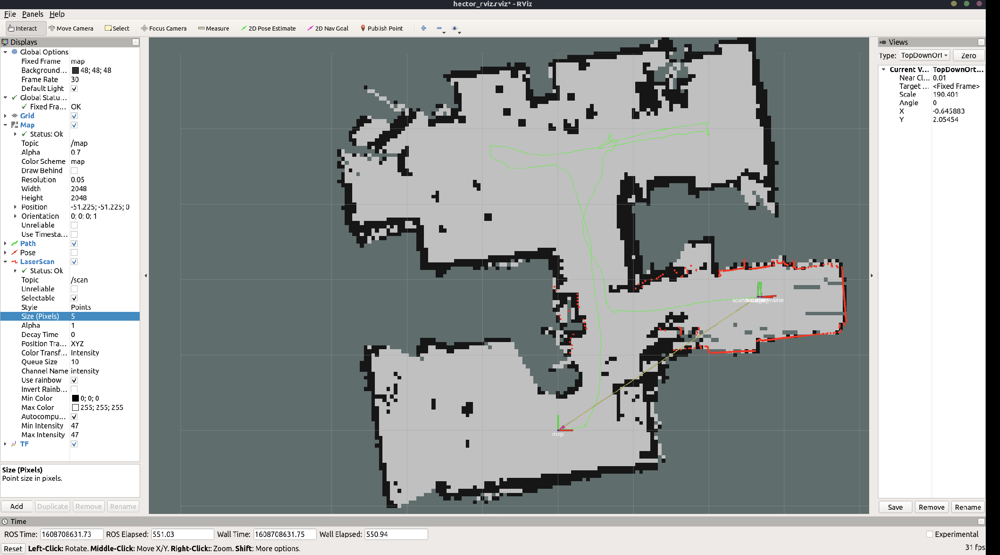

# Quick Start to Hector SLAM Mapping

I've been working on a building a mobile robot platform test existing localization and mapping algorithms with the idea of gaining deeper understanding of hardware/software integration and the algos themselves.

From Hector SLAM Wiki:
> hector_mapping is a SLAM approach that can be used without odometry as well as on platforms that exhibit roll/pitch motion (of the sensor, the platform or both). It leverages the high update rate of modern LIDAR systems and provides 2D pose estimates at scan rate of the sensors.

Before I build and write odometry and IMU fusion nodes, I decided to try out hector slam as it does not need an odometry source.


## Network Setup



[ROS Multi-machine setup tutorial](http://wiki.ros.org/ROS/Tutorials/MultipleMachines)

## Hardware

- Xbox 360 Controller
- Jetson Nano
- Sabertooth 2x32 Motor Controller
- ServoCity Prowler Robot Kit

## ROS Packages

Tested on Ubuntu 18.04 & ROS Melodic on Jetson Nano

- hector_slam - [ROS Wiki.](http://wiki.ros.org/hector_slam) [Github.](https://github.com/tu-darmstadt-ros-pkg/hector_slam)
- rplidar_ros - [ROS Wiki.](http://wiki.ros.org/rplidar) [Github.](https://github.com/robopeak/rplidar_ros)
- sabertooth_rospy - [Github.](https://github.com/avs2805/sabertooth_rospy) (this is a ROS wrapper/package I had written a while ago to drive motors with a Sabertooth Motor Controller)

## Building your Hector SLAM workspace and package

```bash
## make workspace directories for package organization
source /opt/ros/<your-ros-distro>/setup.bash
mkdir -p ~/catkin_ws/src
cd ~/catkin_ws/src
catkin_init

## clone git packages in your workspace src folder
git clone https://github.com/robopeak/rplidar_ros.git

git clone https://github.com/tu-darmstadt-ros-pkg/hector_slam

git clone https://github.com/avs2805/sabertooth_rospy

cd ~/catkin_ws/src
mkdir -p hector_slam_quickstart/launch
```

**Note:** To get Hector SLAM to work, I made the following changes:

- Make a copy of `hector_slam/hector_mapping/launch/mapping_default.launch` in the folder you created in the last step `hector_slam_quickstart/launch` and change:
  - line 5: change base_frame default to base_link instead of base_footprint. Line 5 should look like: `<arg name="base_frame" default="base_link"/>`
  - line 6: change odom_frame default to base_link instead of nav. Line 6 will look like: `<arg name="odom_frame" default="base_link"/>`
  - line 54: uncomment `<node pkg="tf" type="static_transform_publisher" name="map_nav_broadcaster" args="0 0 0 0 0 0 map nav 100"/>` (you may want to add actual tf dimensions in the args here)

- Make a copy of `hector_slam/hector_slam_launch/launch/tutorial.launch` in the folder you created in the last step `hector_slam_quickstart/launch` and call it `hector_slam_quickstart.launch` and make the following changes:
  - line 7: change `use_sim_time` to false
  - line 14 name of arg has to be changed to hector_geotiff_launch from hector_geotiff `<include file="$(find hector_geotiff_launch)/launch/geotiff_mapper.launch">`

```bash
## install ROS dependencies
cd ~/catkin_ws
rosdep install --from-paths src --ignore-src -r -y

## build packages
catkin_make

## if all goes well, source in 3 separate terminals
source devel/setup.bash

## and launch 
roslaunch sabertooth_ctrl sabertooth.launch
roslaunch rplidar_ros rplidar.launch
roslaunch hector_slam hector_slam_quickstart.launch

## After mapping, save map
rosrun map_server map_server <your-map-name>.yaml

```

## Mapping visualized in rviz:




## Useful links and references:

- [NickL77's hector SLAM Github.](https://github.com/NickL77/RPLidar_Hector_SLAM)
- [Tiziano Fiorenzani's Video on Hector Slam with RPlidar.](https://www.youtube.com/watch?v=Qrtz0a7HaQ4)